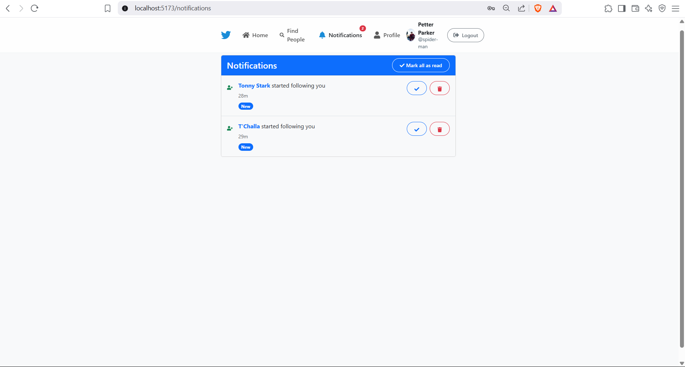
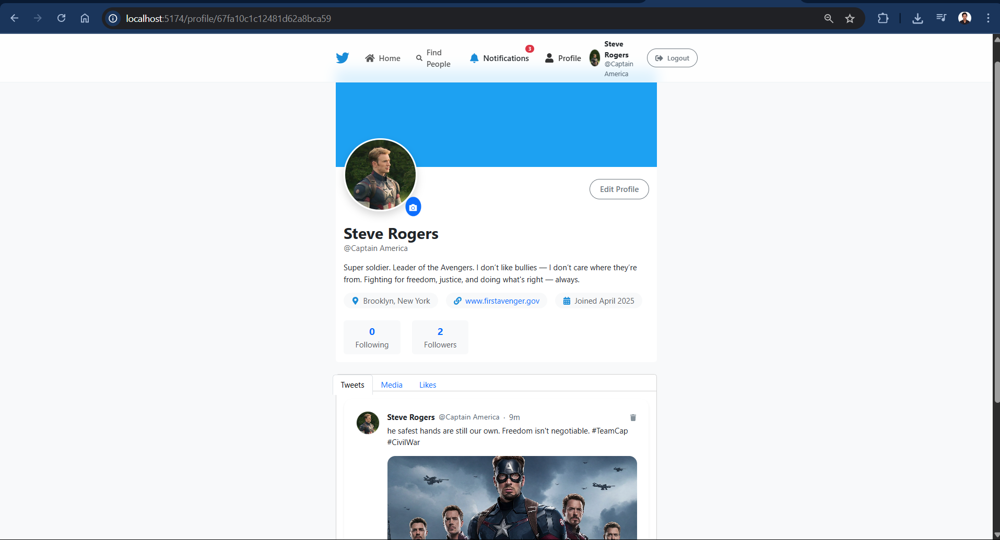
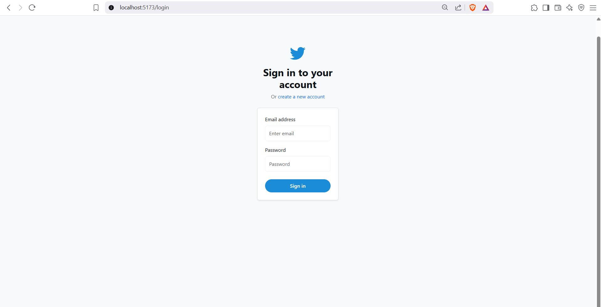
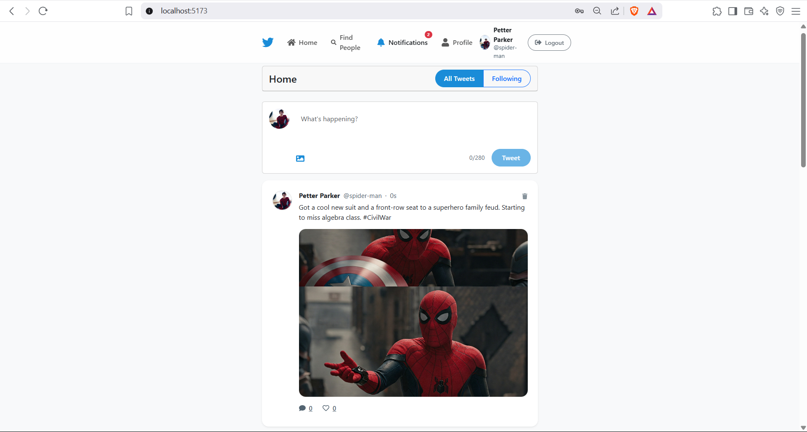

Here's your updated README for the **Twitter Clone** project, styled similarly to your **ChatApp** README:

---

# Twitter Clone 🐦

A full-stack Twitter Clone application where users can share thoughts, follow each other, like & comment on tweets, and more. Built using the MERN stack (MongoDB, Express, React, Node.js) with Cloudinary support for image uploads.

## 🧠 Features

- 🔐 User Authentication (Register, Login, Logout)
- 📝 Create, Read, Update, Delete Tweets
- ❤️ Like/Unlike & 💬 Comment on Tweets
- 👥 Follow/Unfollow Users
- 👤 View & Update User Profiles
- 📰 Timeline Feed (tweets from followed users)
- 🔍 Advanced Search for Users
- 🔔 Real-time Notification System
- 💻 Responsive Design using React Bootstrap

## 🛠️ Tech Stack

### Frontend
- React.js
- React Router
- Context API
- React Bootstrap
- Axios

### Backend
- Node.js
- Express.js
- MongoDB + Mongoose
- JWT (Authentication)
- bcrypt (Password Hashing)
- Cloudinary (Image Storage)

---

## 🚀 Getting Started

### 📦 Prerequisites

- Node.js
- MongoDB
- Cloudinary Account

### 🛠️ Installation

```bash
git clone https://github.com/yourusername/twitter-clone.git
cd twitter-clone
```

#### Install Backend Dependencies

```bash
cd backend
npm install
```

#### Install Frontend Dependencies

```bash
cd ../frontend
npm install
```

### ⚙️ Environment Variables

Create a `.env` file in the **backend** directory:

```
NODE_ENV=development
PORT=5000
MONGO_URI=mongodb://localhost:27017/twitter-clone
JWT_SECRET=your_jwt_secret
JWT_EXPIRE=30d
CLOUDINARY_CLOUD_NAME=your_cloudinary_cloud_name
CLOUDINARY_API_KEY=your_cloudinary_api_key
CLOUDINARY_API_SECRET=your_cloudinary_api_secret
```

### ▶️ Run the App

Start Backend Server:

```bash
cd backend
npm run server
```

Start Frontend Dev Server:

```bash
cd frontend
npm run dev
```

---

## 📡 API Endpoints

### 🔑 Authentication

| Method | Endpoint           | Description              |
|--------|--------------------|--------------------------|
| POST   | /api/auth/register | Register a new user      |
| POST   | /api/auth/login    | Login existing user      |
| GET    | /api/auth/me       | Get logged-in user       |
| GET    | /api/auth/logout   | Logout user              |

### 👤 Users

| Method | Endpoint                        | Description               |
|--------|----------------------------------|---------------------------|
| GET    | /api/users                       | Get all users             |
| GET    | /api/users/:id                   | Get user by ID            |
| PUT    | /api/users/profile               | Update user profile       |
| PUT    | /api/users/:id/follow            | Follow a user             |
| PUT    | /api/users/:id/unfollow          | Unfollow a user           |
| GET    | /api/users/search                | Search users              |
| GET    | /api/users/:id/followers         | Get followers of a user   |
| GET    | /api/users/:id/following         | Get following of a user   |

### 🐦 Tweets

| Method | Endpoint                            | Description                   |
|--------|--------------------------------------|-------------------------------|
| POST   | /api/tweets                          | Create a new tweet            |
| GET    | /api/tweets                          | Get all tweets                |
| GET    | /api/tweets/timeline                 | Get timeline tweets           |
| GET    | /api/tweets/user/:id                 | Get user tweets               |
| GET    | /api/tweets/:id                      | Get tweet by ID               |
| DELETE | /api/tweets/:id                      | Delete a tweet                |
| PUT    | /api/tweets/:id/like                 | Like a tweet                  |
| PUT    | /api/tweets/:id/unlike               | Unlike a tweet                |
| POST   | /api/tweets/:id/comment              | Add comment to tweet          |
| DELETE | /api/tweets/:id/comment/:comment_id  | Delete a comment              |

### 🔔 Notifications

| Method | Endpoint                              | Description                     |
|--------|----------------------------------------|---------------------------------|
| GET    | /api/notifications                     | Get all notifications           |
| GET    | /api/notifications/unread-count        | Get unread notifications count  |
| PUT    | /api/notifications/:id/read            | Mark one notification as read   |
| PUT    | /api/notifications/read-all            | Mark all as read                |
| DELETE | /api/notifications/:id                 | Delete a notification           |

---

## 📸 Screenshots

You can include screenshots like this inside your `README.md`:

```md




```

---

## 📄 License

This project is licensed under the [MIT License](LICENSE).

